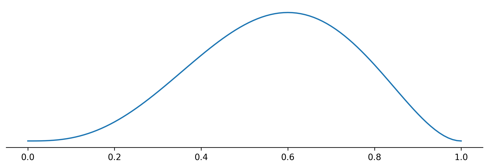

# Estimators

### Question

Let $a_1, ..., a_n \in \bR$ and let $\bar{a}$ be the average of $\{a_1, ..., a_n\}$, i.e. $\bar{a} = \frac{1}{n} \sum_i a_i$. Which of the following statements is true:

1. $\bar{a} = \argmin_{a'\in \bR} \sum_i a_i - a'$ 
2. $\bar{a} = \argmin_{a'\in \bR} \sum_i (a_i - a')^2$ 

---

## Summarizing a (probability) distribution

We often want to summarize a distribution with one number. For example, the grades of a student, the incomes of citizen in a country, our beliefs about a certain unknown parameter. In statistics, this number is called an estimator. In this post we discuss some considerations for choosing an estimator. 

### Different objectives

One possible objective for an estimator $a^*$ is to minimize the expected distance from a sample from the distribution. 

$$a^*_{(1)} =  \argmin_{a'\in \bR} \int |x - a'| p(x) dx$$

It turns out that this objective leads to $a^*_{(1)}$ such that 

$$ \int_{-\infty}^{a^*_{(1)}} p(x) dx = \int^{\infty}_{a^*_{(1)}} p(x) dx,$$

which is the median. 

Another objective is the following:

$$a^*_{(1)} =  \argmin_{a'\in \bR} \int (x - a')^2 p(x) dx,$$

which leads to the average, or expected value, of the distribution. I.e.

$$ a^*_{(2)}  = \bE_{p(x)}(x) = \int x p(x) dx. $$

The last objective we discuss is the following:

$$ a^*_{(3)} = \argmax_{a'\in \bR} p(a').  $$

Which is called the mode. In the context of parameter estimation, where the distribution is a posterior distribution, this estimator is called the maximum a posteriori probability (MAP) estimator. Closely related to this is the estimator 

$$ \theta_{\textrm{MLE}} = \argmax_{\theta' \in \bR} p(D|\theta),$$

where 
$$p(D|\theta)$$ 
is the likelihood of the data $D$ given a parameter $\theta$. Note that $p(D|\theta)$ as a function of $\theta$ is not a distribution. 

### Estimators in practice

#### 1 urn

Consider an urn with $N$ balls of which $R$ are red. We draw $n$ balls from the urn without replacement of which $r$ are red. In the post [_Laplace's Rule of Succession_](/blog/laplaces-rule-of-succession) we saw that the posterior belief of the total number of red balls $R$ given total number of balls $N$, data $D = (n,r)$, and initial information about the setup of the experiment $I$ is given by

$$
\begin{align*}
    p(R \mid DNI) = \binom{N+1}{n+1}^{-1} \binom{R}{r}\binom{N-R}{n-r}. 
\end{align*}
$$

Suppose $N=100, n=5, r=2$. The plot for the posterior looks as follows: 

The estimators defined above can be plotted as follows: 

#### Coin flip

Suppose we have a coin that comes up heads a fraction $\theta$. Assuming a uniform prior, the posterior belief about $\theta$ after having observed $r$ times heads after $n$ tosses is given by (see Appendix [_Laplace's Rule of Succession_](/blog/laplaces-rule-of-succession)): 

$$ p(\theta|DI) = \frac{(n+1)!}{r!(n-r)!} \theta^r (1-\theta)^{n-r}. $$

For $n = 5$ and $r=3$ the posterior plot looks as follows:

The estimators defined above can be plotted as follows: 

## Discussion

In different contexts different estimators are preferred. If you are gambling and $X$ is the random variable representing the profit (revenue - costs) of a bet, the estimator most of interest to you is the expectation of $X$.  

If you have to represent the income distribution in a country, it could be argued that the median is the most representative estimator. 

For (categorical) distribution without a clear distance measure on the sample space, the only possible estimator is the mode. 

### Summarizing the posterior of the coin flip 

It could be argued that the value that summarizes the best the posterior 
$$ p(\theta|DI) $$
is the probability of thowing heads on the next throw, 
$$P(H_{n+1}|DI).$$

In we saw that this is given by 

$$ 
\begin{align*}
    P(H_{n+1}|DI) &= \int_0^1 P(H_{n+1}|\theta DI) p(\theta|DI) d \theta \\
    &= \int_0^1 \theta p(\theta|DI) d \theta,
\end{align*}
$$

which is the expected value of the posterior. 

