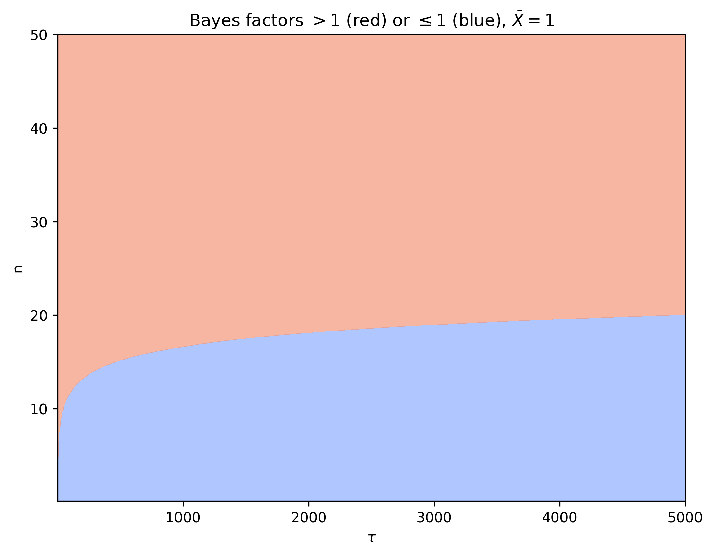
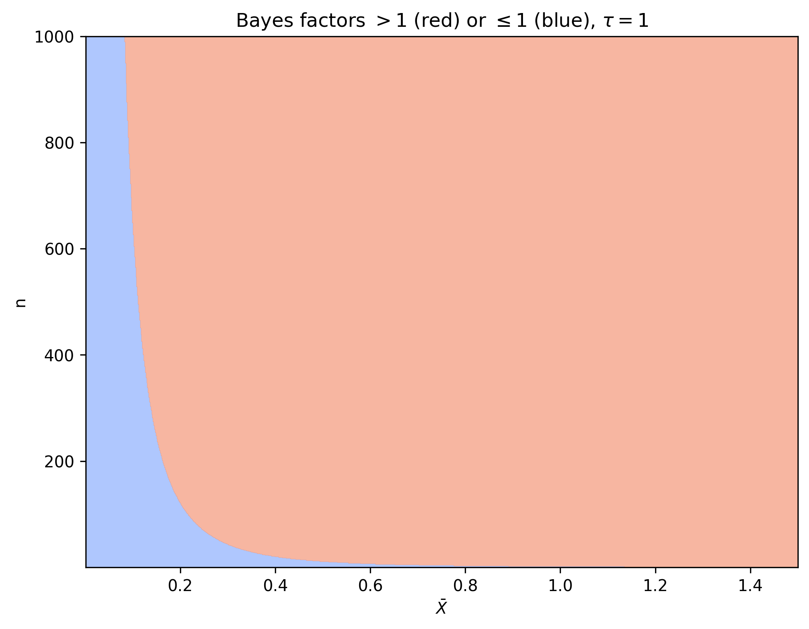
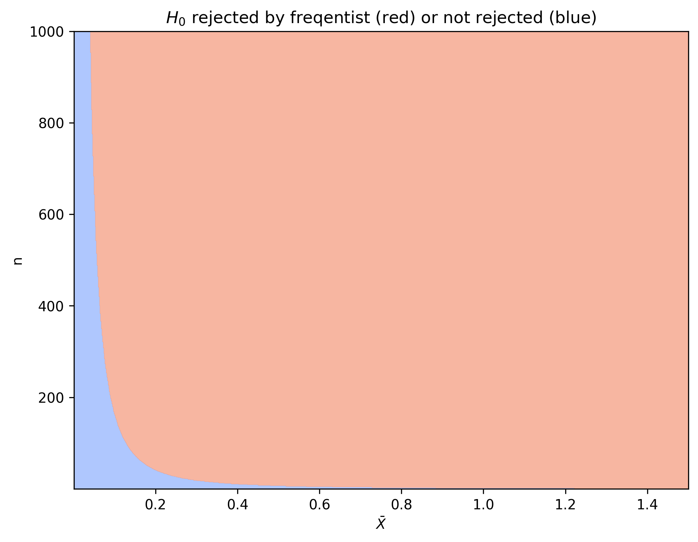
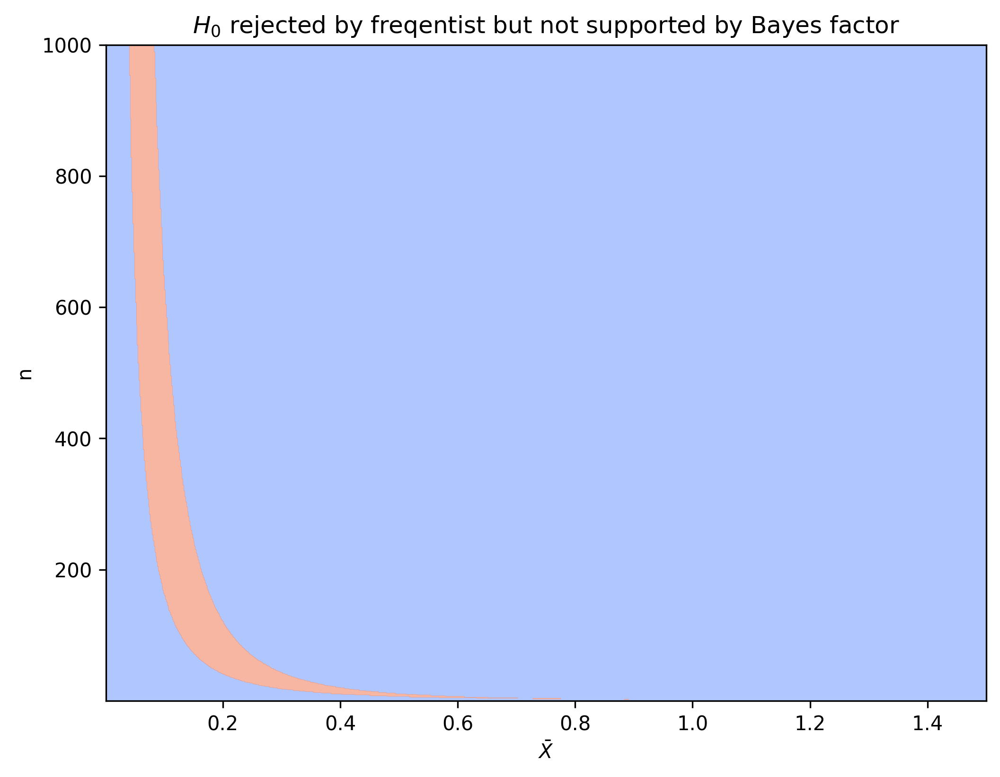

# Lindley's Paradox

Suppose we have data $X_1, ..., X_n$ from a normal distribution $\cN(\theta, 1)$ and we want to determine whether $H_0: \theta = 0$ or $H_1: \theta \neq 0$. 

## Bayesian approach 

In general, given two hypotheses $H_0$ and $H_1$, the posterior odds are given by

$$ 
\frac{P(H_1 |x)}{P(H_0 |x)} = \frac{P(H_1)}{P(H_0)} * \frac{P(x | H_1)}{P(x | H_0)}. 
$$

This shows that our posterior belief about $H_1$ increases when the likelihood ratio $\frac{P(x \vert H_1)}{P(x \vert H_0)}$ (also called the _Bayes factor_) is larger than $1$. 

For both hypotheses we specify a prior distribution $p(\theta \vert H_i)$, which is used to calculate the likelihood $P(x \vert H_i) = \int_\Theta p(x \vert \theta) p(\theta \vert H_i) d\theta $. Under $H_0$ this is the Dirac distribution at 0. As a prior under $H_1$ we choose a normal distribution with mean 0 and variance $\tau^2$, still to be determined. The Bayes factor between the hypotheses is then given by

$$
\frac{\int \prod_{i=1}^n \phi\left(X_i-\theta\right) \phi(\theta / \tau) / \tau d \theta}{\prod_{i=1}^n \phi\left(X_i\right)}=\frac{1}{\sqrt{1+n \tau^2}} e^{\frac{1}{2} n \tilde{X}^2 /\left(1+\left(n \tau^2\right)^{-1}\right)} .
$$

For $n \tau^2 \gg 1$ this expression is approximately equal to $\tau^{-1} n^{-1 / 2} \exp \left(n \bar{X}^2 / 2\right)$. 

For $\bar{X} = 1$ we can visualize whether the Bayes factor is larger than 1 (red) or smaller than 1 (blue) for different values of $\tau$ and $n$. 

Note that for larger values of $\tau$ we need a larger $n$ before the Bayes factor speaks in favor of $H_1$. 

Similarly for fixed $\tau = 1$ we visualize the Bayes factor for different values of $\bar{X}$ and $n$. 

From here we see that when $\bar{X}$ gets small, we need a large $n$ before the Bayes factor speaks in favor of $H_1$. 

## Frequentist approach

We know that $\sqrt{n}\bar{X} \sim \cN(\sqrt{n}\theta, 1)$. Therefore, if $\theta$ would be zero, the probability of observing a specific value for $\sqrt{n}\bar{X}$ is distributed according to the standard normal distribution. We use $\xi_p$ to denote the value for which the probability of sampling a standard normal random variable is smaller than $\xi_p$ is equal to $p$, i.e. the inverse of the cumulative distribution. A frequentist would reject $H_0$ when $\sqrt{n}\bar{X} > \xi_{1-\alpha/2}$ for some significance level $\alpha$. 

We can plot the values of $\bar{X}$ and $n$ for which $H_0$ is rejected in red as follows. 

## The paradox 

Note that there is a region where the outcome of Bayesian analysis and frequentist analysis differs. 

Let us choose a $\theta_n$ for every $n$. If we choose $\theta_n$ such that $\sqrt{n}\theta_n \to \infty$ than we know that a frequentist will reject $H_0$ as $n \to \infty$ since $\sqrt{n}\bar{X}$ will get larger than the constant $\xi_{1-\alpha/2}$. 
If we however also choose $\theta_n$ such that $\sqrt{n} \theta_n \ll \sqrt{\log n}$ than the data  will not support $H_1$ for a Bayesian. Thus, we can construct a sequence of $\theta_n$s such that the frequentist's conclusions based on the data are correct but the Bayesian's are incorrect when $n \to \infty$. 

Note however that when we choose $\theta_n$ such that $\sqrt{n}\theta_n \to 0$ than the frequentist will also be incorrect. 

